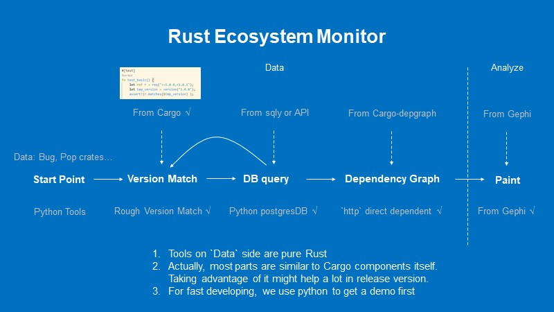
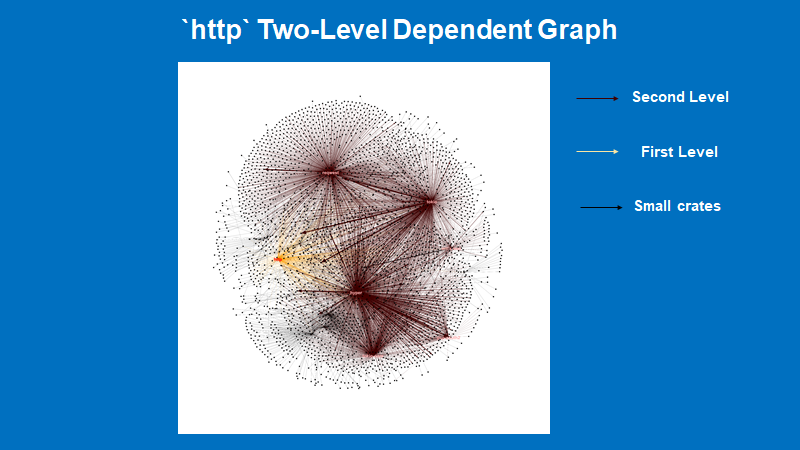
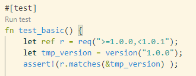

# Cargo-Ecosystem-Monitor

Actually we divide it into two parts:
- Propagation: **Package granularity**. Mainly focus on the Rust package manager. This won't analyse any codes inside the package. It only present an overview of the whole ecosystem. Our project of this part is called "Cargo Ecosystem Monitor
- Reachibility and Trigger Detection(Pending): In this case, we must statically(main form) or dynamically analyse the **codes inside crates**.
  - Function revocation: Is specific bug crate invoked by other crates through dependency?
  - Codes clone: In some ways, we have to manually copy+paste others' codes as we want to modify them, which bypasses Cargo. This may cause delay update of related codes and they are often hard to maintain. Example: https://users.rust-lang.org/t/dependency-conflict/61807/5
  - Unsafe <-> Safe function: Can goalkeeper funtion make itself safe? It need propagation, type safety and other types of analysis.

Now, we only focus on the "propagation" which is much easier.

### Propagation

Now, we are going to write scripts to get something useful from crates.io. 

#### Get data

For scrawlers, we use `requests` for getting htmls and `BeautifulSoup` for analyse.  However, when it `requests` try to get "crates.io", it recieves 404, which I can't get rid of. So I changed it to `Scrapy`. But it can't get dynamic contents. So I use `Scrapy-Splash` to achieve this goal. But it still has technique problems that can't be solved within days. 

Problems:

- Splash docker fails: https://blog.csdn.net/whatday/article/details/86762264
- How to use scrapy-splash: https://www.youtube.com/watch?v=mTOXVRao3eA
- Relative path resolution: Unsolved
- Timeout: Unsolved

However, we find other tricy methods. Crates.io database API is open! See https://crates.io/data-access for help.

**Finally, we directly used the data from official crates.io.**

#### Steps

Now, we have got all the data as csv format. Next, we follow the steps provided by the official to import it into **PostgreSQL** database. The next question is how to display the structure of the graph and find useful information.

We have constructed 5 steps to Analyse the data.
1. Start point(Get Data, Send requiry, etc): 
   1. Get top 1% popular crates(~774 crates) and all crates in Github Adversory Database.
   2. Analyse how large 1% packages can spread by dependents. And how large can Aversories reach by dependents.
   3. Find the relationship between team and person.
   4. etc
2. Version match: If you want to get specific information of the crate, you have to give a specific verison or range, which requires version match.
   1. Version parse: Tell if a specific version is within the given range.
   2. Version selection: In Cargo dependency, there will only be one version among given range that will finally be used accoring to dependency rules. 
3. DB query (Or online API):  In this step, we have to look up to the database or send quiries through API to get crates metadata.
4. Dependency Graph: Through version match, we can form the dependency graph or dependent graph from the start point.
5. Paint: Display graph or other forms in a appropriate way.

#### Implementaion

For fast developing, we use two paths: Python and Rust. The former helps get a demo fast. The later forms a release tool.

Python: We write scripts to roughly do the Version Match, and use postgreDB to access data and get dependency graph in .csv form, which is then loaded to Gephi to get final graph. We select a bug in http, which clearly caused much propagation. https://github.com/advisories/GHSA-x7vr-c387-8w57

##### Full Rust Path

To get complete and accurate results, we reuse components in Cargo project.

1. Version Parse: See project `semver` file `tests/test_version_req.rs line 35 fn test_basic()`. You can change codes as the pic below. Then `run test` and modify to find out how it works. After that, you can just import `semver` library for "Version parse". . 
2. Version selection: Before Cargo builds the file, it will first generates `Cargo.lock` which contains specific version of each dependency crate. So we have to find out the logic codes of the generation.
   1. `cargo::core::dependency::Dependency::parse()`: Attempt to create a Dependency from an entry in the manifest. Might help in Version Selection of a single crate. https://docs.rs/cargo/latest/cargo/core/dependency/struct.Dependency.html
   2. Dependency graph: `Struct cargo::util::graph::Graph`. I think that in `cargo::core::Resolve`, Graph stores all one-level dependency in `Graph`, and each in `Dependency`. We need pick up logic codes that generate full Resolve. https://docs.rs/cargo/latest/cargo/core/struct.Resolve.html#
   3. Detailed implementation can be found in `src/cargo/core/resolver/encode.rs`.This module contains all machinery necessary to parse a `Resolve` from a `Cargo.lock` as well as serialize a `Resolve` to a `Cargo.lock`. Doc: https://docs.rs/cargo/latest/cargo/core/resolver/index.html
3. DB query( Or Online API): In `cargo/core/resolver/encode.rs fn into_resolve()`.
4. Related Cargo doc: `src/doc/contrib/src/architecture/files.md`. Some tips for you: Search "Cargo.lock" in vscode, you may find related information.

#### Useful tools

Now, we've got some great tools as follows:
- PostgreSQL(Applied): Database that Cargo used.
  - VSCode Plugin(Applied): "PostgreSQL", very helpful.
- Gephi(Applied): Display graphs and networks. It is very powerful and renders awesome pictures.
  - Gephi can't run in java 11: Use newest nightly version https://github.com/gephi/gephi
  - Alternative solution(not applied): https://linuxanteportas.wordpress.com/2020/12/25/running-gephi-on-fedora-33/
  - No graph is shown: open the 'Window' menu and select 'Graph
- Install PostgreSQL(Applied): https://www.digitalocean.com/community/tutorials/how-to-install-and-use-postgresql-on-ubuntu-20-04
- Remote Access to pgAdmin4(Not applied): https://blog.logrocket.com/setting-up-a-remote-postgres-database-server-on-ubuntu-18-04/
- Can't connect to DB in python: https://stackoverflow.com/questions/18664074/getting-error-peer-authentication-failed-for-user-postgres-when-trying-to-ge
- Can't find package after using pip3: try `python3 -m pip install xx`

Useful discussion:

- Cargo update: https://github.com/rust-lang/cargo/issues/3265, https://doc.rust-lang.org/cargo/commands/cargo-update.html.
- Cargo.lock: https://doc.rust-lang.org/cargo/guide/cargo-toml-vs-cargo-lock.html

#### Other related projects

- RustSec: https://github.com/rustsec/rustsec
- Cargo-lock: https://github.com/RustSec/rustsec/tree/main/cargo-lock
- Cargo-audit: https://github.com/RustSec/rustsec/tree/main/cargo-audit
- Others: See [OtherTools](./OtherTools.md)
